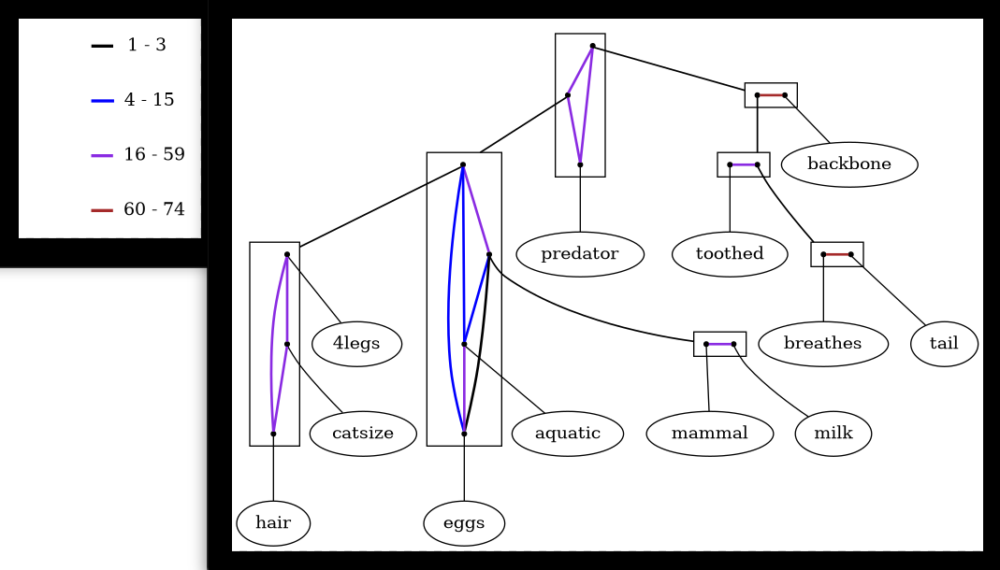
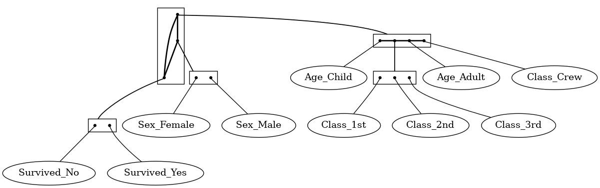

# degais

### Decomposing Gaifman Structures (again): Minimal documentation

 
 

<!--- 

Check out this one day:
https://github.com/cookiecutter/cookiecutter

Does pipx install degais need to be preceded by `sudo` ?)

venv activation in PowerShell: directly call e. g.
.\testdegais\bin\Activate.ps1 

--->

 
 

(Image: screen capture of the outcome of 
`degais zoo --coloring expwidth --param 3.9`.)

Current version: early Frimaire 2024, 
planned to be made publicly available.

Author: Jose Luis Balcazar, ORCID 0000-0003-4248-4528,
relying in large parts on the functionality of 
[code by Marie Ely Piceno](https://github.com/balqui/labgaif),
although fully rewritten.

Copyleft: [MIT License](https://en.wikipedia.org/wiki/MIT_License).

Umpteenth attempt at having a working platform on which 
we can view 2-structure decompositions of generalized 
Gaifman graphs.

## Installation

The recommended installation is through `pipx` 
which will cater for isolating virtual environments on itself:

`pipx install degais`

(In turn, `pipx` can be installed with `pip` in the usual way.)

Alternatively, good old `pip install degais` should work but
will complain and require you to `break system packages` unless
you are installing it in a virtual environment, which is also
a good and safe idea.

## Usage

Data is expected as a transactional dataset: a sequence of
transactions, one per line, each consisting of a set of items:
(almost) arbitrary strings separated by spaces; however, 
characters ':' and '-' should not appear in items. In case
of emergency, a simple adjustment to the `ezGraph.py` file
allows for '-', but ':' is outlawed by 
[our dependency on Sebastian Bank's `graphviz`](https://graphviz.readthedocs.io/en/stable/manual.html#node-ports-compass).

For the time being, it is a command line tool to be run on
a CLI shell such as a GNOME Terminal, a konsole, a PowerShell, etc.
Python and [Graphviz](graphviz.org) must be available
(call `python` or `python3` to test the first and `dot -V` to
test the second).

For example, assuming that you have downloaded to your current folder the file 
[zoo.td](https://github.com/balqui/degais/blob/main/testdata/zoo.td),
you may run

`degais zoo.td --freq_thr 30 --coloring expwidth --param 7.7`

and hit return when asked whether to continue (an opportunity to stop 
the program with any of n/N/no/No/NO if you see that it will try to 
draw too big a graph). If all goes well, two windows will pop up 
(besides getting stored as png files): one with the decomposition 
and another one with a legend (see further explanations below).

Call the main program `degais` 
with the options `-h` or `--help`
to refresh yourself about how to employ it. 
More information about the options follows.

Option `-f N` / `--freq_thr N` discards all 
items appearing less than `N` times. 

The `-c` / `--coloring` 
and `-p` / `--param` options are as follows:

`-c` / `--coloring`

`binary`: constructs standard Gaifman graph where
two items are connected exactly if they appear jointly in some
transaction (`--param` is ignored);

`thresh`: `--param T` is interpreted as a threshold, so that
the graph has an edge between two items if they appear together 
in at least `T` many transactions; if `--param` is omitted, 
a default is set, found by an heuristic application of 
(simple cases of) density-estimation-based unsupervised 
discretization;

`linwidth`: edge colors correspond to frequencies of co-occurrence 
falling in intervals of width `L`, if `--param L` is specified, 
otherwise a heuristically determined default for `L` is set;

`expwidth`: edge colors correspond to frequencies of co-occurrence 
falling in intervals of exponentially growing width with base `B`, 
if `--param B` is specified, otherwise a heuristically determined 
default for `B` is set;

`ident`: each co-occurrence frequency gets its own color (but might
exhaust the available colors); most often, this scheme leads to a 
trivial decomposition with a single, very large, spaghetti-shaped 
clan that no one understands.

Additionally, the `-k` / `--complete` option makes sure that all 
the edges are visibly drawn, forming thus a bona-fide 2-structure; 
the default is to draw it as a graph, which might display missing 
edges for cases of zero co-occurrences.

Note: the heuristics that propose a value for `--param` in the 
`thresh`, `linwidth`, and `expwidth` colorings are likely 
to change in future releases.

Two images stored as `.png` files and drawn: one with the 
decomposition corresponding to the coloring and parameter
and a second one (whose window may be hidden behind the decomposition) 
with a legend specifying the co-occurrence intervals corresponding 
to each color. The legend is omitted for the binary coloring scheme.

### Hints

Large primitive clans do not provide any intuition about the dataset;
the more potential "colors" are allowed, the larger primitive
clans show up, hence it is recommended that only up to 4 or 5 color
values are employed. Default values of the parameter for each option 
may fail spectacularly: check out all the information provided in order
to identify explicit alternative values to explore.

### Example

File [zoo.td](https://github.com/balqui/degais/blob/main/testdata/zoo.td)
contains a transactional version of the famous Zoo
dataset of UCI; there, for simplicity, only `True` values of the 
Boolean attributes are reflected as items. We suggest next some 
runs that illustrate the workings of `degais`. Pay attention to
the information the program provides: besides the given input and
parameters, we see the quantity of items that will be drawn and 
the highest and lowest number of joint occurrences of pairs of items.

1. Limiting initially the view to a dozen items is advised: use `-f 28`
or `--freq_thr 28` to keep the 12 items appearing at least 28 times. 
All are connected in the standard Gaifman graph (`lowest` reports 
this), so a single complete clan appears.

2. Add `-c thresh` or `--coloring thresh` while specifying `-p 2` or
`--param 2`: it will disconnect the clan `mammal -- milk` from the 
item `eggs`. The reason one needs value 2 for that effect goes by
the name "platypus".

3. Add `-c thresh` or `--coloring thresh` but leaving the actual
threshold value unspecified (no `-p` / `--param`); the default 
value will be at 43 and will disconnect from the larger clan 
a 5-element 2-structure, decomposed in turn.

4. Set other thresholds to `-c thresh`: e. g., try `-p 9` or 
`--param 9` in order to be more strict for the creation of an edge, 
and see more structure appearing. Don't forget to explore intemediate 
and/or larger values.

5. Change the coloring scheme to linear width with `-c linwidth` 
or `--coloring linwidth`. A default parameter of 19 will be guessed
but it still leaves a large primitive clan. Smaller values lead to
more colors so more distinguishable items and larger clans: it is
better to explore larger values, but even then the outcomes are not
spectacular.

6. Try `-c expwidth` instead. A fractional base of 4.1983 will 
be guessed that still leaves a large clan with four smallish ones. 
Try instead `-p 3.9` for a more interesting diagram (image above)
or, even, try `-p 3.99`.

Additional intuition can be gained on the basis of an appropriate
version of the 
[Titanic dataset](https://github.com/balqui/degais/blob/main/testdata/titanic_.td)
used in 
[our IDA 2018 paper](https://link.springer.com/chapter/10.1007/978-3-030-01768-2_20)
([alternative link](https://arxiv.org/abs/1910.05146)).
(Note, however, that the variant of the Zoo dataset employed in 
that paper is richer than the one indicated above, as it records
both a `false` and a `true` version of each attribute.)

