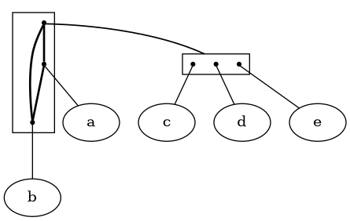

# Summary

We describe here our tool `degais` for computing and visualizing
decompositions of Gaifman structures. These are a generalization of 
undirected graphs whose tree-like decomposition often helps visualizing 
specific properties of data.

Gaifman structures are obtained from transactional data by 
generalizing the existing notion of a Gaifman graph.
In [@IDA2018], we proposed to employ these generalized Gaifman graphs 
as a method of visual data analysis and, specifically, as a way of 
displaying co-occurrence patterns in data. Such a process allows
the user to understand better a given dataset, by showing visually
the roles of each item in the data in terms of their co-occurrence
patterns with other items.

Subsequently, we demonstrated in [@CoIn] how the visualization of
various sorts of Gaifman structures lead to better understanding
of a fully anonymized dataset of patient diagnostics and conditions 
from a local hospital.

As a very simple example, assume that the dataset `e5.td` 
contains three tuples (or: transactions), namely,

|    `a b c`
|    `a b d`
|    `a b e`

Then, a call `degais e5` will produce the following diagram, 
indicating that items `c`, `d`, and `e` never co-occur, but 
all three do co-occur with both `a` and `b` which, also, do co-occur:

{width=80%}

# Statement of need

The software used in [@IDA2018] and, also, the implementations
employed for related documents [@LRNTFG; @MEPPhD; @CoIn] were not 
really usable by other people.
These predecessors of `degais`, closed-source in [@LRNTFG] and 
several variants of open-source implementations for [@MEPPhD; @CoIn],
get replaced now by `degais`, an implementation with which we hope
to offer the possibility of using this data analysis tool 
to any interested person.

# Model foundations

Gaifman graphs are mathematical structures introduced 
several decades ago as a means to study limitations 
of the expressivity of logical languages [@Libkin04].
Their basic notion is pretty simple:
given a dataset consisting of observations, each
observation being a set of _items_ (e. g., attribute-value 
pairs or simply categorical values), for each transaction, 
and for each pair of different items $x$ and $y$ in that 
transaction, we ensure that the edge $(x,y)$ is present
in the graph, and that only such edges are: thus, items
coincide with vertices in the graph, and they remain 
disconnected when they don't appear jointly in any transaction.

Sometimes, we may be interested in keeping track of 
quantitative information that the standard Gaifman graph lacks.
Alternative versions were introduced in [@IDA2018]:

- In thresholded graphs, the difference between having
the edge or not, instead of being zero joint occurrences 
versus 1 or more, resorts to a threshold possibly different from 1:
graph connections represent frequencies of co-occurrence higher than 
or equal to the threshold.

- In the simplest version of labeled Gaifman graphs, the edges are 
labeled by the number of tuples containing both of the vertices that 
they connect. This strategy, in practice, most often leads nowhere.

- In more evolved versions, edge labels are obtained from these same
multiplicities via some sort of discretization process. In linear 
Gaifman graphs, labels correspond to frequencies of co-occurrence 
falling in intervals of some fixed width while in the exponential 
Gaifman graphs a log function is applied first, then the fixed-width
intervals are applied.

We represent visually the labels with different _colors_.

The data analysis approach proposed in [@IDA2018] consists in applying
a decomposition process to the (possibly labeled) Gaifman graphs;
in some cases the so-called modular graph decomposition suffices 
but, in general, one must resort to so-called clans on 2-structures 
[@ERHbook]. This is a concept that generalizes graphs and, 
specifically, symmetric 2-structures generalize undirected graphs
such as Gaifman graphs. We call Gaifman Structures the symmetric
2-structures obtained as the labeled extensions of Gaifman graphs
enumerated above.

Then, the decomposition procedure is based on the so-called "clans".
They extend the intuitive concept of when a vertex "sees in different 
ways" (or: "distinguishes") two other vertices. We say that an item $x$ 
distinguishes two other items if the edges that connect $x$ with 
these two items have different labels. Then, a clan is a set of items 
such that any two members of the clan cannot be distinguished by any 
item outside the clan, an idea that motivated the choice of the term.

Clans can be collapsed into single vertices without any ambiguity 
about how the edges look like after the collapse: from the 
perspective of an outside vertex,
or indeed of a disjoint second clan, all the edges connecting
to nodes inside the clan are of the same equivalence class,
so that class can be chosen for edges upon collapsing
disjoint clans into vertices. Thus, we consider _strong clans_,
those that don't intersect any other clan, and by collapsing
them into vertices we get a tree-like organization of smaller
(hopefully _much_ smaller and clearer) 2-structures.
More precisely,
each maximal strong clan is collapsed to a single vertex;
then, each of these vertices is "opened" to find that its
internal components form also a 2-structure, 
which is decomposed recursively.

The decomposition recursion reaches a limit in two cases.
In a _complete clan_, all the edges are in the same equivalence class, 
every subset is a clan, and there are no strong subclans;
while in a primitive clan there are no nontrivial subclans at all.
It is a theorem of the theory of 2-structures that the nodes of the 
clan decomposition of a symmetric 2-structure 
are all primitive or complete clans. 

# Tool functionality

The tool runs as a CLI call like: `degais dataset`
to which some tuning options can be added.
The data file is expected to contain a transactional dataset: 
a sequence of transactions, one per line, each consisting of 
a set of items.
Items are (almost) arbitrary strings separated by spaces; however, 
characters ':' and '-' should not appear in items.
Available options include `--coloring`, which selects the way
labels ("colors") are decided among the options described
above; `--param` that provides a value needed by some coloring
strategies; and `--freq_thr` that applies a frequency threshold
so as to display only some top frequent items.

Installation, option details and some example runs are detailed in
the current [documentation](https://github.com/balqui/degais/blob/main/docs/doc.md).
Once installed, just the CLI calls should work correctly.

# Example

The case described in [@IDA2018], based on one of the variants of
the famous Titanic dataset, can be replicated by downloading an
appropriate, transactional version of the data 
[from here](https://github.com/balqui/degais/blob/main/testdata/titanic_.td)
and then calling `degais` on it. 

# Acknowledgements

# References

